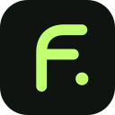

<div align="center">
  
  <h1>Flow</h1>
  <p><strong>Твои видео. Твоя музыка. С собой.</strong></p>
  <p>Загрузчик видео и аудио с YouTube для Android.</p>
  <p><a href="README.md">English</a> &nbsp;|&nbsp; <strong>Русский</strong></p>
  <p><a href="https://github.com/yessensiv/flow-downloader/releases/latest/download/Flow.apk"></a></p>
  <p><a href="https://github.com/yessensiv/flow-downloader/releases/latest">Что нового</a> · Android 8.0+ · Debug-сборка</p>
  <p>Android 8.0+ · Kotlin · Русский и английский · Без сервера</p>
  <p><a href="#начало-работы">Начало работы</a> · <a href="#возможности">Возможности</a> · <a href="#сборка-android-приложения">Сборка</a> · <a href="#локальная-веб-версия">Веб-версия</a></p>
</div>

---

Flow подготавливает видео и аудио прямо на телефоне и помогает управлять сохранёнными файлами. Вставь ссылку YouTube, выбери доступное качество или формат аудио и сохрани результат.

**Android — основное приложение.** В репозитории также есть экспериментальная локальная веб-версия для запуска на компьютере.

## Возможности

| | Что можно делать |
| --- | --- |
| Видео | Выбирать доступные качество и частоту кадров, вплоть до 2160p, если источник их предоставляет. |
| Аудио | Сохранять исходный звук или выбирать MP3, M4A, Opus, FLAC и WAV; для MP3/M4A/Opus доступен битрейт 64–320 кбит/с. |
| Оформление файлов | По желанию встраивать обложку и метаданные; выбирать MKV/MP4 для видео. Поддержка обложки зависит от формата. |
| Прогресс | Видеть процент, скорость и оставшееся время, когда эти данные доступны; отменять загрузку в приложении или уведомлении. |
| Фоновая загрузка | Пользоваться другими приложениями во время подготовки файла; ход работы отображается в уведомлении. |
| Мои загрузки | Просматривать отдельные вкладки видео и музыки с обложками и поиском по названию. |
| Множественный выбор | Удерживать файл для выбора, затем отмечать другие касанием и вместе отправлять или удалять их. |
| Память телефона | Сохранять в системные папки, открывать файлы в других приложениях и делиться ими. |
| Языки | Переключать интерфейс приложения между русским и английским. |

## Начало работы

Текущая версия проекта — **0.20.0**. Открой эту страницу на телефоне, нажми **[Скачать APK](https://github.com/yessensiv/flow-downloader/releases/latest/download/Flow.apk)** для последней опубликованной сборки и открой загруженный файл. Если Android попросит, разреши установку из браузера. Это debug-сборка; для её установки не нужны компьютер и инструменты разработки.

1. Скачай APK кнопкой выше или собери его через [Android Studio или скрипты Windows](#сборка-android-приложения).
2. Скопируй APK на телефон и открой его. Если Android попросит, разреши установку из этого источника. Также можно установить приложение по USB — инструкция ниже.
3. Открой Flow и вставь ссылку либо выбери **YouTube → Поделиться → Flow**.
4. Выбери **Видео** или **Аудио**, нажми **Показать варианты**, затем выбери качество или формат.
5. Запусти загрузку. На Android 10+ готовый файл сохраняется автоматически в системную папку Flow, в том числе в фоне. На Android 8–9 откроется системный выбор места сохранения. Файл появится в разделе **Мои загрузки**.

**Как выбрать несколько файлов:** удерживай любой сохранённый файл, затем отмечай остальные касанием. Групповые действия позволяют отправить или удалить выбранное. Отмени выбор или сними последнюю галочку, чтобы вернуться к обычному просмотру. Удаление файла с устройства требует подтверждения.

### Где находятся файлы?

| Устройство | Папка сохранения |
| --- | --- |
| Android 10 и новее | Видео: `Movies/Flow` · Музыка: `Music/Flow` |
| Android 8–9 | Папка выбирается в системном окне сохранения. |

Сохранённые файлы остаются на телефоне, пока ты их не удалишь. Android-приложению не нужен локальный веб-сервер.

## Сборка Android-приложения

Требуются **JDK 17**, **Android SDK Platform 35** и **Build Tools 35.0.0**. Поддерживаемые архитектуры устройств: ARM64, ARMv7 и x86_64.

### Android Studio

1. Клонируй репозиторий и открой папку `android/` в Android Studio.
2. Установи SDK Platform 35 и Build Tools 35.0.0 через SDK Manager.
3. Синхронизируй проект и собери debug APK.

Готовый файл относительно корня репозитория:

```text
android/app/build/outputs/apk/debug/app-debug.apk
```

### Терминал Windows

Запусти команды из корня репозитория. Скрипт скачает инструменты с проверкой контрольных сумм в игнорируемую папку `.tools/android`.

```powershell
powershell -ExecutionPolicy Bypass -File .\scripts\setup-android.ps1
$sdk = (Resolve-Path .tools\android\sdk).Path
& "$sdk\cmdline-tools\latest\bin\sdkmanager.bat" --sdk_root="$sdk" --licenses
& "$sdk\cmdline-tools\latest\bin\sdkmanager.bat" --sdk_root="$sdk" "platform-tools" "platforms;android-35" "build-tools;35.0.0"
.\scripts\build-android.ps1
```

В macOS/Linux настрой JDK 17 и Android SDK, затем выполни `./gradlew assembleDebug` из папки `android/`.

### Установка по USB

Включи отладку по USB на телефоне, подключи его и подтверди доверие компьютеру. На Windows выполни из корня репозитория:

```powershell
$env:ANDROID_USER_HOME = "$PWD\.tools\android\user-home"
& .\.tools\android\sdk\platform-tools\adb.exe install -r .\android\app\build\outputs\apk\debug\app-debug.apk
```

Этой же командой можно обновить установленную сборку, подписанную тем же ключом. Инструкции создают сборку для разработки, а не релиз для Google Play.

## Что нужно знать

- **Качество зависит от источника.** Flow не повышает разрешение видео искусственно. Конвертация в MP3 192 кбит/с не улучшает исходное качество звука.
- **Для видео доступны MKV и MP4.** Возможность воспроизведения зависит от плеера и исходных кодеков; смена контейнера не меняет видеокодек.
- **Одновременно обрабатывается один файл.** Загрузка зависит от доступности YouTube и подключения. Приватные видео, трансляции и контент, требующий входа, могут не работать.
- **Фоновая работа имеет ограничения.** Энергосбережение Android или принудительная остановка Flow могут прервать загрузку. После перезагрузки или принудительной остановки активная задача не возобновляется.
- **Изменения YouTube могут влиять на загрузку.** При ошибке получения данных попробуй обновить движок через приложение. Обновление не гарантирует работу каждой ссылки.
- **Данные аккаунта YouTube не требуются.** Flow не использует cookies YouTube или пароли аккаунтов.

## Локальная веб-версия

Веб-приложение — экспериментальный локальный прототип. Файлы подготавливаются сервером Node.js с помощью yt-dlp и FFmpeg.

Требуются **Node.js 24+**, npm, FFmpeg и интернет.

```sh
npm ci
npm run setup:media
```

На Windows установи локальные инструменты FFmpeg:

```powershell
powershell -ExecutionPolicy Bypass -File .\scripts\setup-ffmpeg.ps1
```

На macOS/Linux установи FFmpeg через пакетный менеджер системы. Затем запусти приложение:

```sh
npm run dev
```

Открой [localhost:3000](http://127.0.0.1:3000). Для нестандартного расположения инструментов скопируй `.env.example` в `.env.local` и укажи `YTDLP_PATH` и/или `FFMPEG_PATH`.

В отличие от Android, веб-версия хранит готовые файлы на сервере **5 минут**. Задачи и квоты находятся в памяти одного процесса и теряются после перезапуска. Публичный хостинг не настроен; для serverless или нескольких экземпляров нужны дополнительные средства хранения и управления задачами.

## Разработка

### Автоматическая сборка Android

[](https://github.com/yessensiv/flow-downloader/actions/workflows/android.yml)

GitHub Actions собирает изменения Android при отправке в `main` и в pull request. Собираются приложение и тесты для устройства, запускаются lint и имеющиеся JVM-тесты. APK доступен в артефактах запуска 14 дней. Тесты на устройстве этот процесс только компилирует, но не запускает. Сборку также можно начать вручную: **Actions → Android → Run workflow**.

Для новой публикации сначала измени `versionName` и увеличь `versionCode` в `android/app/build.gradle.kts`, создай коммит и отправь его. Затем отправь соответствующий тег (например, `v0.21.0`, если versionName уже равен `0.21.0`):

```sh
git tag v0.21.0
git push origin v0.21.0
```

После сборки по тегу в Releases появятся `Flow.apk` и его контрольная сумма SHA-256. Кнопка скачивания в README начнёт вести на новый релиз. Уже опубликованные релизы автоматически не заменяются.

Для доверенных сборок используется прежний ключ подписи из зашифрованного секрета репозитория `FLOW_DEBUG_KEYSTORE_BASE64`: обновление можно установить поверх старого Flow. В pull request ключ не передаётся; такие APK подписываются временным ключом и предназначены только для тестирования. В форке для сборок веток и тегов нужно настроить собственный секрет подписи. Это по-прежнему сборки для разработки, не релизы Google Play.

| Команда | Назначение |
| --- | --- |
| `npm run dev` | Запуск локального веб-сервера разработки. |
| `npm run build` | Сборка веб-приложения. |
| `npm run start` | Запуск собранной веб-версии. |
| `npm run typecheck` | Проверка типов TypeScript. |
| `npm test` | Тесты веб-версии. |
| `.\scripts\build-android.ps1` | Сборка Android debug APK на Windows. |

```text
android/   Нативное приложение на Kotlin
app/       Веб-интерфейс и API
lib/       Серверная логика, форматы и задачи загрузки
tests/     Тесты веб-версии
scripts/   Настройка инструментов и локальные проверки
docs/      Оформление README
```

Нашёл ошибку? [Создай issue](https://github.com/yessensiv/flow-downloader/issues): укажи версии приложения и Android, шаги воспроизведения и текст ошибки или скриншот.

## Благодарности

Используются [youtubedl-android](https://github.com/yausername/youtubedl-android), [yt-dlp](https://github.com/yt-dlp/yt-dlp) и [FFmpeg](https://ffmpeg.org/). Веб-приложение построено на [Next.js](https://nextjs.org/). Зависимости имеют собственные лицензии и условия распространения.

Сохраняй контент, на скачивание которого у тебя есть разрешение. Flow — независимый проект, не связанный с YouTube или Google.
